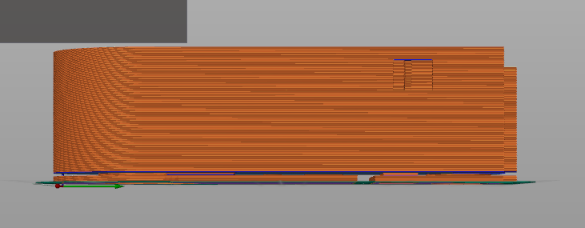

# PRUSASlicer Defects

## Problem
- When modeling a particular STL, the PRUSASlicer variant of Slicer shows a different model than it slices. 
- The sliced model contains defects. This does not occur in the original "Slic3r" or "IdeaMaker"
- the zoomed in image below shows the problem. the defect created a void which causes the base layer to be printed incorrectly.

## Images

